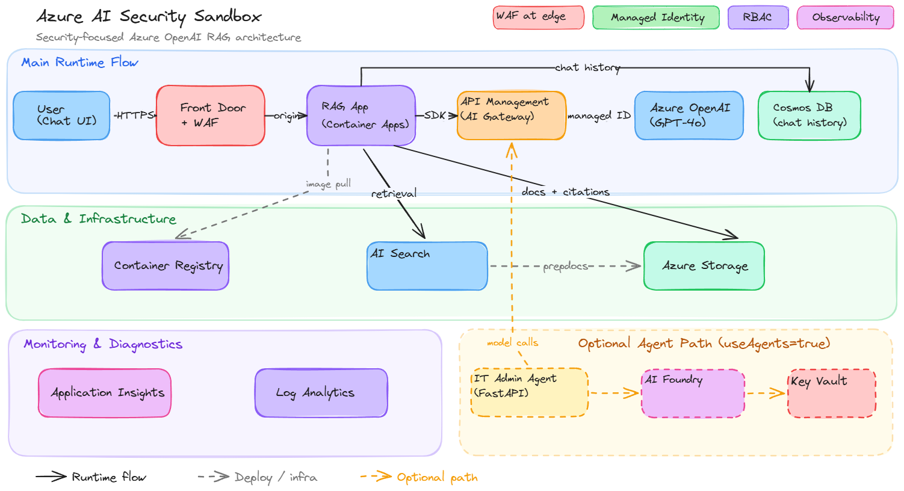

# 🤖 Azure AI Security Sandbox 🔐

[](https://github.com/codespaces/new?hide_repo_select=true&ref=main&repo=matthansen0%2Fazure-ai-security-sandbox&machine=standardLinux32gb&devcontainer_path=.devcontainer%2Fdevcontainer.json&location=WestUs2)
[](https://vscode.dev/redirect?url=vscode://ms-vscode-remote.remote-containers/cloneInVolume?url=https%3A%2F%2Fgithub.com%2Fmatthansen0%2Fazure-ai-security-sandbox)

## 📑 Table of Contents

- [Overview](#-overview)
- [Architecture](#️-architecture)
- [Security Features](#-security-features)
- [Quick Start](#-quick-start)
- [Cost Estimation](#-cost-estimation)
- [Project Structure](#-project-structure)
- [Roadmap](#-roadmap)
- [Cleanup](#-cleanup)
- [Additional Resources](#-additional-resources)
- [Contributing](#-contributing)
- [License](#-license)

> **📖 Want to understand what you deployed?** Read [HOW_IT_WORKS.md](HOW_IT_WORKS.md) for a detailed walkthrough of every component, why we chose these configurations, and what you should know before going to production.
>
> **🧪 Ready to explore hands-on?** Check out the [Lab Guides](docs/labs/README.md) for step-by-step exercises verifying each security layer — WAF, AI Gateway, RBAC, monitoring, Defender, and agent security.
>
> **Responsible AI:** Review the [Responsible AI mapping](docs/responsible-ai.md) for implemented controls, verification evidence, and production gaps across Microsoft's six Responsible AI principles.

## ✨ Overview

A self-contained Azure AI security demonstration platform featuring a RAG (Retrieval-Augmented Generation) chat application with enterprise-grade security controls. This project deploys everything from scratch using Bicep, pulls the [azure-search-openai-demo](https://github.com/Azure-Samples/azure-search-openai-demo) app from upstream at build time, builds it in Azure Container Registry, and deploys to Azure Container Apps with optional Azure Front Door + WAF. **No application code is stored in this repo**—only infrastructure and a minimal Dockerfile.

[](https://repologbook.com/)

## 🏗️ Architecture



## 🔐 Security Features

| Component | Protection | Description |
|-----------|------------|-------------|
| **Front Door + WAF** | Edge Security | OWASP managed rules, bot protection, DDoS mitigation |
| **API Management** | AI Gateway | Centralized AI endpoint management with managed identity auth + retry logic (optional rate limiting / token usage logging) |
| **Defender for AI** | AI Threat Detection | Tracked enhancement (not enabled by default): https://github.com/matthansen0/azure-ai-security-sandbox/issues/14 |
| **Defender for APIs** | API Protection | Optional Defender for Cloud plan (enabled via add-on script) |
| **Defender for Containers** | Container Threat Detection | Optional Defender for Cloud plan (enabled via add-on script) |
| **Defender for Storage** | Data Protection | Optional (enabled via add-on script): malware scanning on upload, sensitive data discovery (PII/PCI/PHI) |
| **Container Apps** | Serverless Containers | Auto-scaling, managed environment, no infrastructure to manage |
| **Defender for Cosmos DB** | Database Security | Optional Defender for Cloud plan (enabled via add-on script) |
| **AI Foundry + Agents** | Agent Security | Optional IT Admin Agent with project-based AI Foundry, managed identity auth, and RBAC-controlled access (set `useAgents=true` to deploy) |
| **Managed Identities** | Zero Secrets | No keys in code—all services authenticate via Azure AD |

### 🚪 API Management as AI Gateway

Azure API Management acts as a centralized **AI Gateway** providing:

- **Managed Identity Auth** - APIM authenticates to Azure OpenAI using its managed identity (no keys)
- **Retry Logic** - Automatic retry with exponential backoff for 429s and 5xx errors
- **Optional: Rate Limiting / Quotas** - Add incrementally once the basic gateway flow is stable
- **Optional: Token Usage Logging** - Add incrementally; policy expressions can be finicky

> Note: The default deployed policy set is intentionally minimal/known-good (auth + retry). Advanced policy logic (rate limiting, token parsing, extra tracing) should be added carefully and validated against APIM GatewayLogs.

## 🚀 Quick Start

### Prerequisites

- Azure subscription with Owner or Contributor access
- [Azure Developer CLI (azd)](https://learn.microsoft.com/azure/developer/azure-developer-cli/install-azd) installed
- Azure CLI installed and authenticated
- (Optional) GitHub Codespaces or VS Code with Dev Containers

### Deploy with Azure Developer CLI (Recommended)

The easiest way to deploy is with `azd`:

```bash
# Clone the repository (--recurse-submodules pulls the upstream app code)
git clone --recurse-submodules https://github.com/matthansen0/azure-ai-security-sandbox.git
cd azure-ai-security-sandbox

# Login to Azure (both are needed – azd for provisioning, az CLI for post-deploy hooks)
az login
azd auth login

# Deploy everything with one command
azd up
```

That's it! `azd up` will:
1. Prompt you for an environment name and Azure region
2. Provision all infrastructure via Bicep
3. Clone azure-search-openai-demo from GitHub, build the image in ACR, and deploy to Container Apps
4. Configure Front Door routing if `useAFD` is true
5. Output the application URL

> **⏱️ Deployment Time:** Full deployment takes **30-50 minutes** depending on configuration:
> | Resource | Time |
> |----------|------|
> | Most resources | < 30 seconds |
> | Cosmos DB | ~1-2 minutes |
> | APIM (BasicV2) | ~5-10 minutes |
> | APIM (Developer) | ~20-40 minutes |
> | Front Door + WAF | ~10-15 minutes |
> | AFD WAF propagation | ~30-45 minutes |
>
> **Fastest iteration:** Use `--parameter useAFD=false --parameter useAPIM=false` to deploy in ~5 minutes.

To skip Front Door for faster iteration, disable it during provisioning:

```bash
azd up --parameter useAFD=false
```

To skip API Management (APIM AI Gateway) for faster iteration:

```bash
azd up --parameter useAPIM=false
```

Or disable both for the fastest development cycle:

```bash
azd up --parameter useAFD=false --parameter useAPIM=false
```

To deploy with the optional **IT Admin Agent** (adds a project-based AI Foundry account + Project and agent Container App):

```bash
azd up --parameter useAgents=true
```

When Front Door is disabled, `APP_PUBLIC_URL` points directly to the Container App FQDN.

### Tests and Validation

The [CI workflow](.github/workflows/ci.yml) compiles Bicep, checks shell syntax, tests the regional preflight, and runs the IT Admin Agent pytest suite for every pull request and push to `main`. The `azd up` preprovision hook repeats the preflight and agent tests before deployment.

Run the offline checks manually:

```bash
python3 -m venv .venv-tests
./.venv-tests/bin/pip install -q pytest pytest-asyncio httpx -r ./agents/it-admin/requirements.txt
cd agents/it-admin
../../.venv-tests/bin/python -m pytest tests/ -v --tb=short
cd ../..
bash scripts/tests/preflight-check.test.sh
bash -n scripts/*.sh scripts/tests/*.sh
az bicep build --file infra/main.bicep --outfile /tmp/azure-ai-security-sandbox-main.json
```

Agent test files:
- `agents/it-admin/tests/test_api.py` — FastAPI health, tools, tool invocation, chat, content type, conversation, and destructive-tool safety coverage
- `agents/it-admin/tests/test_tools.py` — unit/regression coverage for tool schemas, mock resource data, tool handlers, edge cases, and agentic scenarios
- `agents/it-admin/tests/conftest.py` — shared pytest fixtures

After deployment, run `bash scripts/validate.sh` for end-to-end regression validation across the labs, including the optional project-based AI Foundry account + Project checks when `useAgents=true`.

The postprovision hook stages the upstream sample data outside the read-only submodule before indexing. If an Azure Policy disables the Storage public endpoint, [scripts/prepdocs-search-only.py](scripts/prepdocs-search-only.py) preserves upstream parsing, embeddings, and Search ingestion while omitting Blob page uploads.

#### Other azd Commands

```bash
azd provision          # Just provision infrastructure (no code deploy needed)
azd down               # Tear down all resources
azd env list           # List environments
azd monitor            # Open Azure Portal monitoring
```

### Deployment Parameters

You can customize the deployment with optional parameters:

```bash
# Deploy to a specific region
azd up --location japaneast
```

The preprovision hook verifies Azure AI Search quota plus the exact `gpt-4o` and `text-embedding-3-small` model versions, Standard SKU availability, and TPM capacity before resources are created.

Other useful parameters:

```bash
# Disable Azure Front Door (use Container Apps URL directly)
azd up --parameter useAFD=false

# Disable Azure API Management (AI Gateway)
azd up --parameter useAPIM=false
```


### Optional: Enable Defender Plans (Add-on)

This repo keeps subscription-wide Defender enablement out of the core `azd up` path.

WARNING: Defender plans are enabled at the subscription scope (billing + coverage). If you run this in a shared subscription, it will apply beyond this sandbox.

To enable the Defender plans used by this architecture (after `azd up`):

```bash
./scripts/enable-defender.sh --confirm
```

To roll back subscription-wide plan changes made by the script:

```bash
./scripts/disable-defender.sh --confirm
```

This add-on enables subscription-wide plans for: Containers, APIs, Storage, and Cosmos DB.

It also applies **Defender for Storage advanced settings** (malware scanning + sensitive data discovery) to the sandbox storage account.

Note on **Defender for AI**: availability and the underlying plan name can vary (and may appear under a different pricing name in `az security pricing list`). If you want it included, first list your available plans and then add the appropriate plan name via `additionalPricingPlanNames` in [infra/addons/defender/main.bicep](infra/addons/defender/main.bicep).

Tracking work: [docs/issues/defender-for-ai.md](docs/issues/defender-for-ai.md)

State tracking: the script writes a local state file under `.defender/` so you can roll back subscription-wide plan changes later.
```

### Troubleshooting

#### Bicep tooling not working in Codespaces

If Bicep files don’t light up (no syntax highlighting / validation) or provisioning complains about missing Bicep:

- Confirm the `Bicep` extension is installed (`ms-azuretools.vscode-bicep`).
- Rebuild the Codespace (this forces extension re-install).
- Ensure the Bicep CLI is installed: `az bicep install --upgrade`.

This repo’s devcontainer runs `az bicep install --upgrade` automatically on creation, but an older Codespace may need a rebuild.

#### Soft-Deleted Cognitive Services Resource

Azure Cognitive Services (OpenAI) has **enforced soft-delete** (90-day retention). If you delete and redeploy with the same environment name, you may see:

```
FlagMustBeSetForRestore: An existing resource with ID '...' has been soft-deleted. 
To restore the resource, you must specify 'restore' to be 'true' in the property.
```

**Fix:** Redeploy with the restore flag:
```bash
azd up --parameter restoreSoftDeletedOpenAi=true
```

Or purge the soft-deleted resource first:
```bash
az cognitiveservices account list-deleted
az cognitiveservices account purge --name <name> --resource-group <rg> --location <location>
azd up
```

#### Soft-Deleted API Management Service

Azure API Management has **soft-delete** with 48-hour retention. Service names are globally unique, so if you delete and redeploy with the same name, you may see conflicts.

**Fix:** Purge the soft-deleted APIM service first:
```bash
az apim deletedservice list --subscription <subscription-id>
az apim deletedservice purge --service-name <name> --location <location>
azd up
```

#### Subscription-Level Deployment Conflicts

### What Gets Deployed

1. **Resource Group** with all resources
2. **Log Analytics Workspace** for monitoring
3. **Azure OpenAI** with GPT-4o and embedding models
4. **Azure AI Search** for document indexing
5. **Azure Storage** for document blobs
6. **Azure Cosmos DB** for chat history
7. **Azure Container Apps** running the RAG application (cloned from upstream and built in ACR at deploy time)
8. **Azure API Management** as AI Gateway for managed identity auth + retry logic (optional rate limiting/token tracking) (set `useAPIM=false` to skip)
9. **Azure Front Door + WAF** for edge protection (WAF defaults to Detection mode, set `useAFD=false` to skip)
10. **Microsoft Defender for Cloud** is not enabled in the core deployment; enable plans and per-resource Defender settings via the add-on script
11. *(Optional)* **IT Admin Agent** - AI-powered troubleshooting agent with tool calling (set `useAgents=true`)
12. *(Optional)* **Azure AI Foundry** account + Project for agent management (deployed with agents)

### 💰 Cost Estimation

Estimated costs for running the sandbox (low/dev usage). Actual costs vary based on usage.

| Configuration | Daily | Monthly |
|--------------|-------|---------|
| **Full deployment** (BasicV2 APIM + AFD) | ~$11-12 | ~$320-350 |
| **Full + Agents** (adds AI Foundry + agent) | ~$12-14 | ~$370-420 |
| **No APIM, No AFD** (fastest iteration) | ~$3-4 | ~$95-120 |

**Cost breakdown by resource:**

| Resource | Monthly Cost | Notes |
|----------|-------------|-------|
| API Management (BasicV2) | ~$180 | Use `useAPIM=false` to skip |
| Front Door Premium + WAF | ~$45 | Base + WAF policy |
| AI Search (Basic) | ~$75 | Fixed tier cost |
| Azure OpenAI | ~$5-20 | Pay per token (GPT-4o + embeddings) |
| Cosmos DB (Serverless) | ~$5-10 | Pay per RU |
| Container Apps | ~$5-20 | Consumption-based |
| Container Registry (Basic) | ~$5 | Image storage |
| Storage Account | ~$1-2 | Blob storage for docs |
| Log Analytics + App Insights | ~$5-10 | Pay per GB ingested |
| AI Foundry account + Project | ~$0-5 | Optional (`useAgents=true`); management plane |
| Agent Container App | ~$5-10 | Optional (`useAgents=true`); consumption-based |

> **💡 Cost-saving tips:**
> - Use `--parameter useAFD=false` to skip Front Door during development (~$45/mo savings)
> - Use `--parameter useAPIM=false` to skip APIM for local testing (~$180/mo savings)
> - Remember to `azd down --force --purge` when not using the environment

### Access the Application

After deployment completes, use the Front Door URL (also shown as `APP_PUBLIC_URL` in `azd up` outputs).

```
https://<your-frontdoor-endpoint>.azurefd.net
```


## 📝 Roadmap

### v2.0 (Current Focus)
- [x] APIM + Defender for APIs validation (end-to-end)
- [x] Real architecture diagrams (not ASCII)
- [ ] SQL data source + Defender for SQL
- [ ] Azure AI Content Safety integration

### v3.0 (Future)
- [ ] Microsoft Purview for DLP
- [ ] Data & AI Security Dashboard
- [ ] Private endpoint deployment option

## 🧹 Cleanup

### With azd (Recommended)
```bash
azd down --force --purge
```

If you enabled Defender plans via the add-on script and want to revert subscription-wide changes, run:

```bash
./scripts/disable-defender.sh --confirm
```

The `--purge` flag triggers a `postdown` hook that automatically purges the environment's soft-deleted Azure OpenAI, Foundry account, and APIM resources, preventing conflicts on future deployments.

## 📖 Additional Resources

- [Responsible AI mapping for this sandbox](docs/responsible-ai.md)
- [Azure OpenAI Landing Zone Reference Architecture](https://techcommunity.microsoft.com/blog/azurearchitectureblog/azure-openai-landing-zone-reference-architecture/3882102)
- [Azure AI Adoption Framework](https://learn.microsoft.com/azure/cloud-adoption-framework/scenarios/ai/)
- [Microsoft Defender for Cloud](https://learn.microsoft.com/azure/defender-for-cloud/)

## 🤝 Contributing

Contributions welcome! Please open an issue first for major changes.

## 📄 License

MIT License - see [LICENSE](LICENSE) for details.
